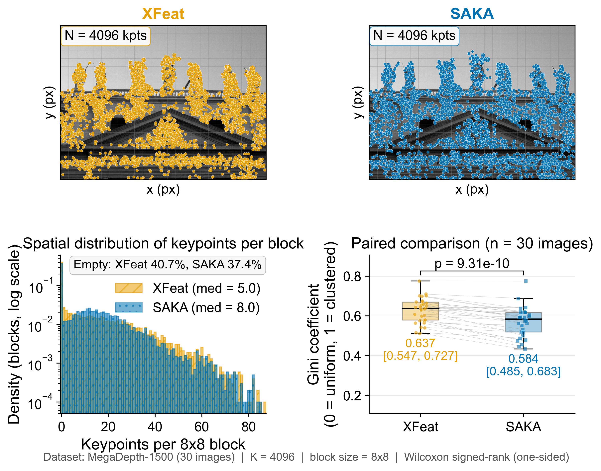
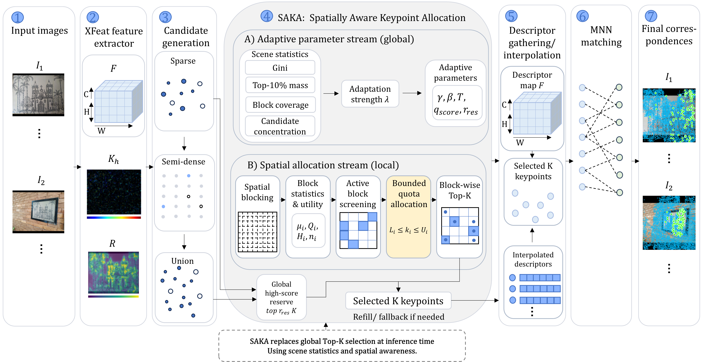
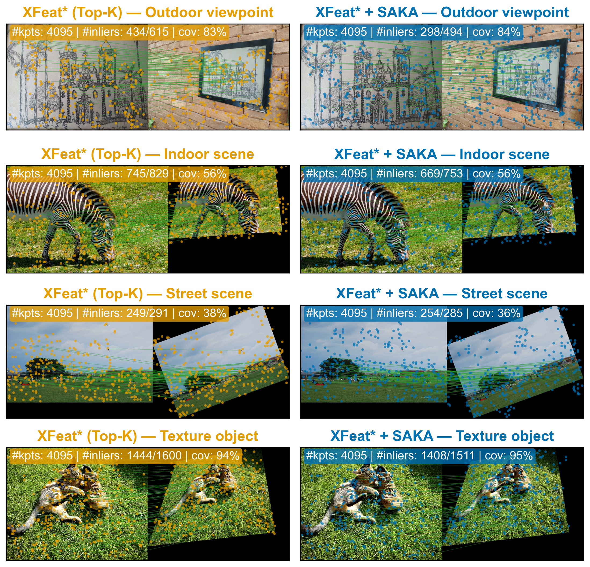

# SAKA: Spatially Aware Keypoint Allocation for Lightweight Image Matching

**Haoran Zhao · Leyan Chen · Haokai Wen · Wentao Cheng**<br>
Faculty of Science and Technology, Beijing Normal-Hong Kong Baptist University, Zhuhai, China

[](LICENSE)

SAKA is a training-free replacement for global Top-K keypoint selection. It keeps strong candidates while distributing a fixed budget across useful image regions. SAKA changes only selection: detector weights, descriptors, matching, and geometric verification stay unchanged.

<p align="center">
  
</p>

*With the same 4,096-keypoint budget, SAKA reduces spatial concentration and improves block coverage.*

## Overview

<p align="center">
  
</p>

The implementation is integrated into the sparse and semi-dense XFeat paths and the included ALIKE wrapper. No retraining is required.

## Results

<p align="center">
  
</p>

Selected results from the paper's matched baseline–SAKA protocol:

<table align="center">
  <thead>
    <tr>
      <th align="center">Benchmark</th>
      <th align="center">Baseline</th>
      <th align="center">SAKA</th>
      <th align="center">Gain</th>
    </tr>
  </thead>
  <tbody>
    <tr>
      <td align="center">MegaDepth-1500, XFeat* AUC@10°</td>
      <td align="center">66.1</td>
      <td align="center"><strong>67.4</strong></td>
      <td align="center">+1.3</td>
    </tr>
    <tr>
      <td align="center">MegaDepth-1500, XFeat* AUC@20°</td>
      <td align="center">77.6</td>
      <td align="center"><strong>78.8</strong></td>
      <td align="center">+1.2</td>
    </tr>
    <tr>
      <td align="center">ScanNet-1500, XFeat* AUC@10°</td>
      <td align="center">34.5</td>
      <td align="center"><strong>35.6</strong></td>
      <td align="center">+1.1</td>
    </tr>
    <tr>
      <td align="center">Aachen night, XFeat recall @ 0.5 m / 5°</td>
      <td align="center">86.7</td>
      <td align="center"><strong>90.8</strong></td>
      <td align="center">+4.1</td>
    </tr>
  </tbody>
</table>

## Installation

Install a compatible PyTorch build first, then install the remaining
requirements:

```bash
git clone https://github.com/nuo534202/SAKA.git
cd SAKA
pip install -r requirements.txt
```

The default XFeat checkpoint is `weights/xfeat.pt`; ALIKE checkpoints are in `third_party/ALIKE/models/`.

## Inference

`XFeat` uses the scene-adaptive SAKA allocator by default:

```python
import torch
from modules.xfeat import XFeat

model = XFeat(top_k=4096, adaptive_scene=True)
image = torch.randn(1, 3, 480, 640)
result = model.detectAndCompute(image)[0]

print(result["keypoints"].shape)
print(result["scores"].shape)
print(result["descriptors"].shape)
```

Use `adaptive_scene=False` for the fixed-parameter allocator. The smoke test also covers batched extraction and matching:

```bash
python minimal_example.py
```

## Evaluation

Download the benchmark files:

```bash
python -m modules.dataset.download --megadepth-1500 --download_dir /path/to/datasets
python -m modules.dataset.download --scannet-1500 --download_dir /path/to/datasets
```

Run MegaDepth-1500:

```bash
python -m modules.eval.megadepth1500 \
  --dataset-dir /path/to/datasets/Mega1500 \
  --matcher xfeat --ransac-thr 2.5
```

Run ScanNet-1500:

```bash
python -m modules.eval.scannet1500 \
  --scannet_path /path/to/datasets/ScanNet1500 \
  --output /path/to/datasets/ScanNet1500/output
```

You can choose the matcher between `xfeat`, `xfeat-star` and `alike`.

## Citation

```bibtex
@inproceedings{zhao2026saka,
  title     = {SAKA: Spatially Aware Keypoint Allocation for Lightweight Image Matching},
  author    = {Zhao, Haoran and Chen, Leyan and Wen, Haokai and Cheng, Wentao},
  booktitle = {International Conference on Vision, Image and Signal Processing (ICVISP)},
  year      = {2026}
}
```

## License

[Apache License 2.0](LICENSE). Code derived from XFeat and ALIKE is documented in [THIRD_PARTY_NOTICES.md](THIRD_PARTY_NOTICES.md); see [ALIKE LICENSE](third_party/ALIKE/LICENSE) for the ALIKE license.
